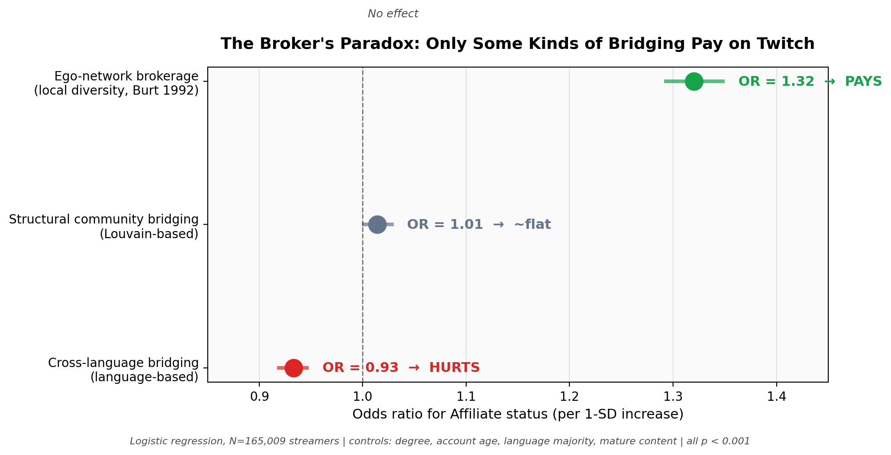
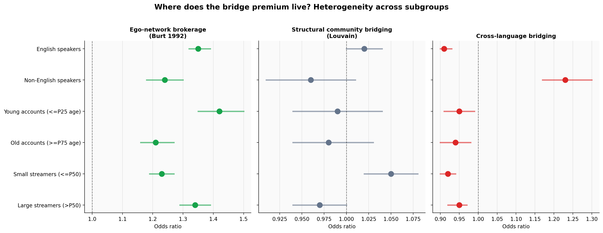

# The Broker's Paradox 🎭

**Testing Burt's Structural Holes Theory on 168,000 Twitch Streamers**

A graduate data-mining project testing a classic 30-year-old theory of social capital against modern creator-economy data. The finding: Ronald Burt's *structural holes* theory partly survives — but **language is a wall the theory does not cross**.

> 👉 **Start here: [`main_notebook.ipynb`](main_notebook.ipynb)** — the curated story of the project.
> 🎥 **2-minute pitch video:** [youtu.be/U0zgOHqXI7Q](https://youtu.be/U0zgOHqXI7Q)

---

## Overview

For three decades, Ronald Burt's *structural holes* theory has argued that people who bridge disconnected groups enjoy a success premium — faster promotions, higher pay, better ideas. The theory has been validated across managers, scientists, investment bankers, and TQM teams. It has **never been rigorously tested on a creator platform**.

We test it on the SNAP Twitch Gamers dataset — **168,114 streamers** linked by **6.8 million mutual-follow ties**, with Twitch Affiliate status (the platform's monetization gate) as a clean binary success outcome.

We operationalize "bridge" three ways — ego-network brokerage (Burt's classical constraint), cross-community bridging via Louvain, and cross-language bridging — and find them **nearly uncorrelated**. Controlling for degree, account age, and language-majority status:

| Bridge type | Odds Ratio (per 1-SD) | Verdict |
|---|---|---|
| **Ego-network brokerage** (Burt 1992) | **1.32** [1.29, 1.35] | 🟢 **Pays** |
| Structural community bridging (Louvain) | 1.01 [1.00, 1.03] | ⚪ ~flat |
| **Cross-language bridging** | **0.93** [0.92, 0.95] | 🔴 **Hurts** |

Burt's theory survives at the ego-network scale but inverts at cultural boundaries. Two additional findings sharpen this:

- **The affiliate-vs-views inversion:** brokerage *helps* affiliation but *hurts* viewership; cross-language bridging *hurts* affiliation but *helps* viewership. The two success metrics reward opposite network structures.
- **The English/non-English asymmetry:** the cross-language penalty is entirely a majority-language phenomenon. Non-English streamers who bridge *toward* English are rewarded (OR ≈ 1.23); English streamers who bridge outward are penalized (OR ≈ 0.91). Formally confirmed by an interaction test.

---

## Research question

> **On Twitch, do streamers who bridge disconnected communities enjoy a success premium — as Burt's classic social-capital theory predicts — after controlling for reach and tenure? And does the answer depend on what kind of bridge we mean?**

---

## Project video

🎥 **[The Broker's Paradox — 2-minute pitch](https://youtu.be/U0zgOHqXI7Q)**

A 2-minute narrated slide deck introducing the motivation, method, and headline finding. Built for investors / recruiters / anyone curious who doesn't want to read a notebook.

---

## Repo structure

```
.
├── README.md                       <- this file
├── main_notebook.ipynb             <- 👉 THE MAIN DELIVERABLE — start here
├── requirements.txt                <- pip freeze from the Colab session
├── .gitignore
│
├── checkpoints/                    <- semester-progression artifacts (graded earlier)
│   ├── checkpoint_1.ipynb          <- three candidate datasets (explored, then narrowed)
│   └── checkpoint_2.ipynb          <- three candidate RQs (narrowed to one per guidance)
│
├── src/                            <- reusable helper modules
│   ├── __init__.py
│   └── graph_metrics.py            <- participation_coefficient, fit_logit_with_inference, compute_vif
│
├── scripts/
│   └── download_data.py            <- fetches SNAP Twitch Gamers (~15MB) into .data/
│
├── data/                           <- raw data lives here locally (gitignored; see below)
├── cache/                          <- gitignored; expensive computations are cached here
└── assets/
    └── figures/                    <- PNGs rendered by the notebook (forest plots, calibration, etc.)
```

---

## Data

**Dataset:** [SNAP Twitch Gamers](https://snap.stanford.edu/data/twitch-social-networks.html) (Rozemberczki & Sarkar, 2021)

- 168,114 nodes (Twitch streamers, snapshot Spring 2018)
- 6,797,557 edges (mutual-follow ties, undirected)
- Node attributes: `views`, `language`, `created_at`, `updated_at`, `life_time`, `affiliate`, `dead_account`, `mature`

The dataset is **not committed** to the repo (≈15 MB zipped). Download it with:

```bash
python scripts/download_data.py
```

Or run the notebook — it fetches + extracts on first run.

**Preprocessing highlights** (all in `main_notebook.ipynb`):
- Degree computed from edge counts; log-transformed to tame the long tail
- Account age derived from `created_at` against the snapshot date (Oct 2018)
- `life_time` dropped from regression controls due to collinearity with `account_age_days`
- Burt's constraint computed only for nodes with degree ≤ 500 (~98.2% of the sample) for computational tractability; mega-hubs are flagged and excluded
- Both NetworkX and igraph graph objects are built — NetworkX for flexibility, igraph for C-speed centrality

---

## How to reproduce

**Everything was built in Google Colab (T4 GPU runtime, ~12GB RAM).** The full pipeline:

1. **Clone the repo:**
   ```bash
   git clone https://github.com/sandsinghal/brokers-premium.git
   cd brokers-premium
   ```

2. **Open `main_notebook.ipynb` in Colab** (or local Jupyter).

3. **Run all cells.** The notebook:
   - Installs dependencies (first cell — restart runtime after)
   - Downloads the dataset (~15 MB) if not already present
   - Computes all graph metrics and caches them under `cache/`
   - Produces all figures under `assets/figures/`

**Runtime:**
- First run from scratch: ~45 minutes (dominated by Louvain ~3–5 min, Burt's constraint ~2 min, and node2vec ~20–30 min)
- Subsequent runs with caches: ~30 seconds

**Memory note:** node2vec is the heaviest step. We use a memory-safe implementation (dim=32, walk_len=10, num_walks=5, streaming walks + gensim Word2Vec) that stays under ~8GB peak RAM. If it still OOMs on a lower-memory machine, the notebook gracefully skips the node2vec robustness check — the main findings do not depend on it.

---

## Key dependencies

Built with:

| Package | Version |
|---|---|
| Python | 3.12 (Colab default Apr 2026) |
| numpy | < 2.0 (pinned — pandas/statsmodels compatibility) |
| pandas | ≥ 2.0 |
| scipy | ≥ 1.11 |
| scikit-learn | ≥ 1.4 |
| networkx | ≥ 3.2 |
| igraph | ≥ 0.11 |
| python-louvain | ≥ 0.16 |
| gensim | ≥ 4.3 (for node2vec) |
| matplotlib | ≥ 3.8 |
| pyarrow | ≥ 15.0 (for parquet caching) |

Full list in [`requirements.txt`](requirements.txt).

---

## Results summary

### The main finding



Three operationalizations of "bridge" predict Affiliate status in three directions:

- **Ego-network brokerage pays** (Burt's theory replicates at the local scale)
- **Structural community bridging is flat** (Louvain spans often occur within-language)
- **Cross-language bridging is penalized** (audience fragmentation breaks the theory at cultural boundaries)

### Where the premium lives



The cross-language penalty is entirely a majority-language (English-speaker) phenomenon; minority-language streamers bridging to English are rewarded. Formally confirmed via interaction test.

### Model diagnostics

- **Likelihood-ratio test:** bridge measures add joint explanatory power beyond controls (p < 10⁻³⁰⁰)
- **VIFs:** all < 5 — no multicollinearity concerns after dropping `life_time`
- **5-fold CV AUC:** improves from ~0.62 (controls only) to ~0.64 (with bridge measures) — modest but statistically real discrimination gain
- **Brier score:** ~0.23 — calibrated probabilistic predictions
- **Propensity-score matching ATT:** confirms the composite broker label's net effect; balance SMDs all < 0.06

### Robustness

- **OLS on log_views** (continuous outcome): signs partially flip — affiliate rewards *depth*, views reward *reach*. A novel, separate finding.
- **Node2vec robustness check:** a fourth, partition-free bridge measure based on node2vec-clustered embeddings is consistent with the main pattern (brokerage coefficient unchanged after controlling for pc_n2v).
- **Bridge burnout:** Burt's "brokerage cost" hypothesis partially supported — structural community bridging predicts higher churn (OR ≈ 1.25); cross-language bridging, interestingly, predicts *lower* churn.

---

## Limitations and future work

- **Cross-sectional snapshot (2018)** — our findings are correlational, not causal. A longitudinal panel would support within-streamer fixed effects, dramatically strengthening identification.
- **Degree cap on Burt's constraint** excludes ~1.8% mega-hubs — conservative for our scientific question but limits generalizability to elite streamers.
- **One platform, one year.** Whether the cross-language penalty holds in 2025 or on YouTube/TikTok is an open question.
- **Future directions:** longitudinal panel with fixed effects; instrumental-variable designs using exogenous network churn; direct audience-overlap measurement to test the fragmentation mechanism; a cross-platform replication; a field experiment in partnership with Twitch.

---

## Author

**Shivam Singhal** — CSCE 676 (Data Mining), Spring 2026, Texas A&M University
GitHub: [@sandsinghal](https://github.com/sandsinghal)

---

## References

- **Burt, R. S. (1992).** *Structural Holes: The Social Structure of Competition.* Harvard University Press.
- **Burt, R. S. (2004).** Structural holes and good ideas. *American Journal of Sociology*, 110(2), 349–399.
- **Guimerà, R., & Amaral, L. A. N. (2005).** Functional cartography of complex metabolic networks. *Nature*, 433(7028), 895–900.
- **Blondel, V. D., Guillaume, J. L., Lambiotte, R., & Lefebvre, E. (2008).** Fast unfolding of communities in large networks. *Journal of Statistical Mechanics*, 2008(10), P10008.
- **Grover, A., & Leskovec, J. (2016).** node2vec: Scalable feature learning for networks. *KDD '16*.
- **Rozemberczki, B., & Sarkar, R. (2021).** Twitch Gamers: A Dataset for Evaluating Proximity Preserving and Structural Role-based Node Embeddings. *arXiv:2101.03091*.
- **Rosenbaum, P. R., & Rubin, D. B. (1983).** The central role of the propensity score in observational studies for causal effects. *Biometrika*, 70(1), 41–55.

---

*Social capital, it turns out, is not cultureless.*
